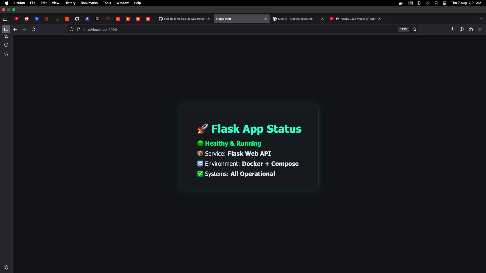

# 🔧 Flask Docker CI/CD Demo

This project is a beginner-friendly DevOps mini-project that demonstrates:

- Containerizing a Python Flask app using **Docker**
- Running it locally with **docker-compose**
- Prepares for further CI/CD pipeline and IaC integrations

## 🖼 Output Screenshot




## 🚀 Tech Stack

- Python 3
- Flask
- Docker
- Docker Compose

## 🧪 Run Locally

```bash
# Build & run the container
docker-compose up --build

Visit: http://localhost:5000
🛠 Next Steps

    Add CI/CD (GitHub Actions or GitLab)

    Push to container registry

    Deploy to K8s cluster or cloud provider

📂 Folder Structure

├── app.py
├── Dockerfile
├── docker-compose.yml
├── README.md
└── .gitignore

👤 Author : Akshay Sirsat — Cloud | DevOps | SRE
🔗 LinkedIn
🌐 akshaysirsat.dev


